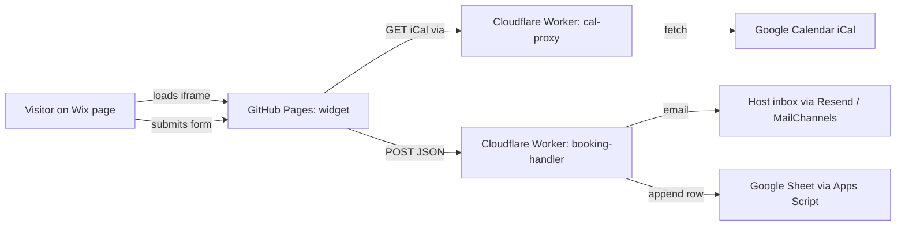

# Booking request form — design proposal

## Goal

Replace the standalone calendar widget with a self-contained **booking
form widget** embedded in Wix via iframe. The form lets visitors:

1. See live availability (free / busy / price per day) — already done.
2. Pick a **stay range** (check-in → check-out) where booked dates are
   unselectable and minimum-stay rules are enforced.
3. Fill in their contact details + message.
4. Submit a booking request, which we route to the host's inbox and a
   Google Sheet (or similar) for record-keeping.

Wix itself is not involved in form processing — the iframe owns the whole
flow. Wix is just the page that hosts the embed.

## Architecture



Two Cloudflare Workers:

- **`calendar-proxy`** — already deployed; serves the iCal.
- **`booking-handler`** — new; receives the POST from the iframe, validates
  it server-side, sends email + writes to sheet.

Both run on Cloudflare's free tier (100k requests/day each — vastly more
than needed for a single rental).

## Widget UI additions

The current month grid stays and **becomes the picker itself** — no
separate date input fields on desktop. On smaller screens (`max-width:
600px`) we swap in native `<input type="date">` pickers because tapping
small cells on a phone is fiddly and the native iOS/Android wheel picker
is faster.

### Desktop layout (calendar-as-picker)

```
┌────────────────────────────────────────┐
│  ◀  June 2026  ▶                       │
│  [ month grid — click days to select ] │
│                                        │
│  Check-in 14 Jun → Check-out 19 Jun    │
│  5 nights · €600   [Clear selection]   │
│                                        │
│  Extras                                │
│    ☐ Whirlpool         + €50           │
│    ☐ Late checkout     + €30           │
│    ☐ Welcome basket    + €25           │
│                                        │
│  Name        [______________]          │
│  Email       [______________]          │
│  Phone       [______________]          │
│  Guests      [ 2 ▾ ]                   │
│  Message     [______________]          │
│                                        │
│  ─────────────────────────────────     │
│  Stay (5 nights)            €600       │
│  Whirlpool                   €50       │
│  ───                                   │
│  Total                      €650       │
│                                        │
│            [ Request booking ]         │
└────────────────────────────────────────┘
```

### Mobile layout (≤ 600px wide)

The month grid still renders for *visualising* availability, but the
range is chosen via two native pickers below it. Busy and out-of-range
dates are disabled in the picker (HTML5 `min`, `max`, plus a `change`
handler that rejects ranges crossing busy days).

```
[ compact month grid, view-only ]

Check-in    [ 14 / 06 / 2026 ▾ ]
Check-out   [ 19 / 06 / 2026 ▾ ]
…
```

### Calendar-picker interaction (desktop)

- **First click** on a free day → check-in, cell highlighted.
- **Second click** on a later free day → check-out; range fills between.
- **Third click** → resets and starts a new selection at that day.
- A range is only accepted if **every day in between is free** and the
  length satisfies `minStay`/`maxStay`. Invalid second clicks show an
  inline error and leave the first selection in place.
- A **Clear** link wipes the selection.
- Each free cell shows its per-day price (already does); selected cells
  get an accent fill so the total is visually obvious.

## Pricing & extras

### Stay cost

Sum of nightly prices across the selected range (already parsed from the
iCal as a `dayKey → price` map). Display "€—" if any day in the range
has no price defined; in that case, submit is allowed but flagged
"price to confirm" in the email.

### Extras

Configured by the host, not the visitor. Each extra has:

- A **key** (machine name, e.g. `whirlpool`)
- A **label** shown to the visitor
- A **price** (number) and how it scales — `flat`, `perNight`, or
  `perGuest`

Two ways to configure, in order of simplicity:

1. **URL params** (good for 1–3 extras):
   ```
   &extras=whirlpool:Whirlpool:50:flat,latecheckout:Late%20checkout:30:flat
   ```
   Format: `key:Label:price:scale` per extra, comma-separated.

2. **JSON file** next to the widget (`extras.json` in the repo) for
   longer lists or per-period pricing:
   ```json
   [
     { "key": "whirlpool", "label": "Whirlpool", "price": 50, "scale": "flat" },
     { "key": "cleaning",  "label": "Cleaning fee", "price": 75, "scale": "flat" },
     { "key": "bedlinen",  "label": "Bed linen", "price": 12, "scale": "perGuest" }
   ]
   ```

Visitor sees checkboxes; selected extras add to the running total and
get included in the booking POST.

### Total breakdown

Live breakdown shown above the submit button:

```
Stay (5 nights · 14 → 19 Jun)    €600
Whirlpool                         €50
Bed linen (2 guests)              €24
─────
Total                            €674
```

The breakdown is also included verbatim in the email to the host and the
row written to the sheet, so there's no ambiguity later.

### Validation rules (configurable via URL params)

| Param        | Default | Meaning                                              |
| ------------ | ------- | ---------------------------------------------------- |
| `minStay`    | `1`     | Minimum nights per booking                           |
| `maxStay`    | `30`    | Maximum nights per booking                           |
| `leadTime`   | `1`     | Min days between today and check-in                  |
| `checkInDay` | —       | Restrict check-in to weekday(s), e.g. `5,6` = Fri/Sat |
| `extras`     | —       | Extras list (see Extras section) or path to JSON      |
| `mobileBreakpoint` | `600` | Width (px) below which native date pickers are used |
| `endpoint`   | —       | URL of the booking-handler Worker (or override)      |

Per-period rules (e.g. "7 nights min in July/August") can be encoded in
the iCal itself by adding the rule to the `FREE:` title, e.g.
`FREE: 200 min7`. We'd parse `min<N>` from the title and apply per-day.

## `booking-handler` Worker — sketch

Pseudocode (~60 lines real JS):

```js
const ALLOWED_ORIGINS = ["https://roel4ez.github.io", "https://YOURWIX.com"];
const RESEND_API_KEY = ENV.RESEND_API_KEY;         // Cloudflare secret
const SHEETS_WEBHOOK = ENV.SHEETS_WEBHOOK_URL;     // Apps Script URL
const TO_EMAIL = "host@example.com";

export default {
  async fetch(req, env) {
    // CORS preflight
    if (req.method === "OPTIONS") return cors(req);
    if (req.method !== "POST") return new Response("method not allowed", { status: 405 });
    if (!ALLOWED_ORIGINS.includes(req.headers.get("Origin"))) {
      return new Response("forbidden", { status: 403 });
    }

    const body = await req.json();
    const errors = validate(body);            // server-side re-validation
    if (errors.length) return json({ errors }, 400, req);

    // Re-check availability against the live iCal (defence in depth)
    const busy = await fetchBusySet(env);
    if (overlapsBusy(body.checkIn, body.checkOut, busy)) {
      return json({ errors: ["Dates no longer available"] }, 409, req);
    }

    // 1. Notify host by email
    await sendEmail({ to: TO_EMAIL, subject: `Booking request from ${body.name}`, body });

    // 2. Append row to Google Sheet
    await fetch(SHEETS_WEBHOOK, { method: "POST", body: JSON.stringify(body) });

    // 3. (Optional) Auto-reply to the guest
    await sendEmail({ to: body.email, subject: "We received your request", body: confirmTemplate(body) });

    return json({ ok: true }, 200, req);
  },
};
```

Key behaviours:

- **Origin check** prevents random scripts from spamming the endpoint.
- **Server-side re-validation** prevents tampered submissions (someone
  could craft a POST claiming an invalid range).
- **Live iCal re-check** prevents the race where two visitors submit
  overlapping ranges at the same time.
- **Rate limiting** via Cloudflare's built-in WAF rules or a small
  Durable Object (1 request per minute per IP is plenty).

## Email delivery

Two free-ish options:

- **Resend** (`resend.com`) — 3,000 emails/month free. Simple API. Best
  deliverability. Requires a verified sending domain (~5 min setup with
  DNS records).
- **MailChannels** — free for Cloudflare Workers, no signup. Less
  configurable, no domain verification needed but emails may end up in
  spam more often.

Recommended: **Resend** if the host has any custom domain; **MailChannels**
otherwise.

## Sheet logging

Easiest: a **Google Apps Script** bound to a Google Sheet, deployed as a
web app with "Anyone" access. Script reads the JSON body and appends a
row. ~10 lines of code.

Alternative: **Airtable** with their personal access token, slightly nicer
UI, free tier covers it.

## Auto-blocking dates after a request

Two flavours, customer's choice:

1. **Manual confirm** (recommended for small operators): the host gets
   the email, reads it, manually creates a `BLOCKED` event in their
   Google Calendar. Widget reflects it within 5 min (proxy cache).
2. **Auto-hold**: the Worker uses the Google Calendar API to create a
   tentative event immediately (e.g. `SUMMARY: HOLD: Smith`). The host
   then confirms or removes. Requires a Google service account + giving
   it edit rights to the calendar. ~30 extra minutes of setup.

## Spam protection

Light defences, no captcha by default:

- **Origin check** + **rate limit** in the Worker (above).
- **Honeypot field** in the form — a hidden input named `website`; if
  filled, drop silently.
- **Time-to-submit check** — record render time, reject submissions in
  < 2 seconds.

If volume grows: add Cloudflare Turnstile (free, less annoying than
reCAPTCHA, drop-in widget).

## Implementation plan (when greenlit)

1. Range-select state machine on the calendar (desktop). (~3 hr)
2. Responsive switch to native pickers ≤ `mobileBreakpoint`. (~1 hr)
3. Form fields + live total + breakdown rendering. (~2 hr)
4. Extras parsing (URL + JSON), per-night/per-guest math. (~1 hr)
5. Per-day `min<N>` parsing from iCal titles. (~30 min)
6. Build `booking-handler` Worker locally, deploy. (~1 hr inc. testing)
7. Wire up Resend + Apps Script sheet. (~45 min)
8. Style passes, README docs. (~1 hr)
9. Optional: Turnstile, auto-hold via Google Calendar API. (~2 hr each)

Total MVP (items 1–8): **roughly 1.5–2 days** of focused work.

## Open questions for the customer

- Required form fields (name + email + dates + message + ?)
- **Extras list**: which ones, at what price, flat / per-night / per-guest?
- Languages — single language or i18n?
- Currency display + tax/cleaning fee handling
- Manual confirm vs auto-hold preference
- Domain available for Resend, or accept MailChannels deliverability?
- Where should bookings land: just email, just sheet, both, CRM?

## Non-goals (deliberately)

- **Payments.** Out of scope; if needed, suggest Stripe Checkout link in
  the confirmation email or a dedicated platform (Lodgify / Smoobu).
- **Channel manager** (Airbnb/Booking.com sync). Out of scope.
- **Wix CRM integration.** Possible later via Wix Velo `postMessage`
  relay if the customer wants leads in Wix Contacts.
